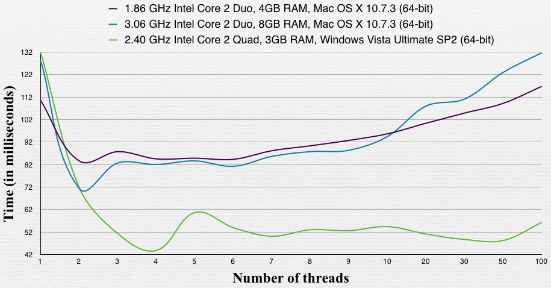
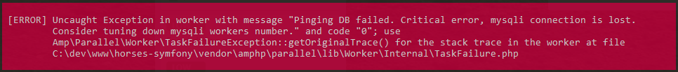

#Horse Prediction Project

## Installation

#### 1. Setting up .env parameters

Each time you want to change behaviour of the algorithm you have to edit .env file by hand.
There's better way to do it. Simply run following command:

```shell
$ php bin/console run:config
```

It'll launch interactive configuration wizard for your appEnv and take care of refreshing values on both dev and prod environments.

## Parser Documention

#### 1.Changing number of active workers

> Since version 0.98.21.1 you shouldn't manually edit .env files.
> Please, use `run:config` command described in section `Installation` of documentation.

-- 

```shell
$ cat .env.prod
```

```shell
mysqliWorkersNumber=4
httpWorkersNumber=4
```

Change numbers in `.env` accordingly to your needs. Generally you want those numbers as close to this formula:

```shell
mysqliWorkersNumber = (NUMBER_OF_CPU_CORES / 2) + 1
httpWorkersNumber = (NUMBER_OF_CPU_CORES) - 1
```
.. experiment to find out best number. It's generally adviced to lower this number on development/local env using `.env.dev`

This graph shows correlation between number of threads and number of CPU cores.


### Available commands
All commands should be run from project's main directory (where files like composer.lock are found).

#### 1. Running scraper 
Scraping data for one day
```shell
$ php bin/console run:scraper {date}
```
Example:
```shell
$ php bin/console run:scraper 2021-03-02
```

You can also parse for date range:
```shell
$ php bin/console run:scraper {startDay} {endDay}
```
Example:
```shell
$ php bin/console run:scraper 2021-03-02 2021-03-05
```

> [WARNING] Date range is very resource heavy, trying to obtain multiple dates at once may cause heavy RAM and CPU usage and may fail in some edge cases.

#### 2. Running results parser 

```shell
$ php bin/console run:results {date}
```
Example:
```shell
$ php bin/console run:results 2021-03-02
```

#### 3. DB and logs purge
In some cases you may want to completely empty logs and database.
There's an option for that. Script will double ask for your consent.

```shell
$ php bin/console run:annihilation
```

## Troubleshooting

### Common errors with parser/scraper


Most probably you're running OS not fully supporting Threads allocation. It's common error on Windows machines. There's no easy way of getting rid of it, you have to **change workers number** (by probably tuning it down a bit) to not cause Threads to terminate.



Change `mysqliWorkersNumber` variable to lower value. Script lost connection to MySQLi server and MySQLi client can't accept more spawned connections.